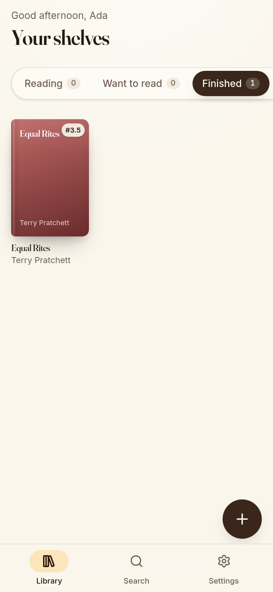
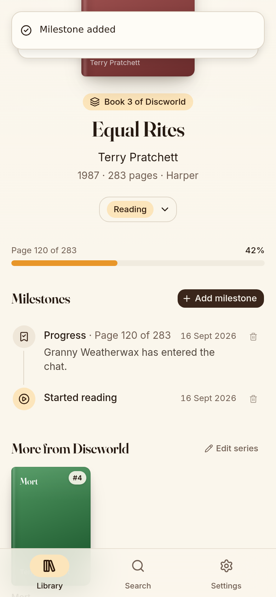
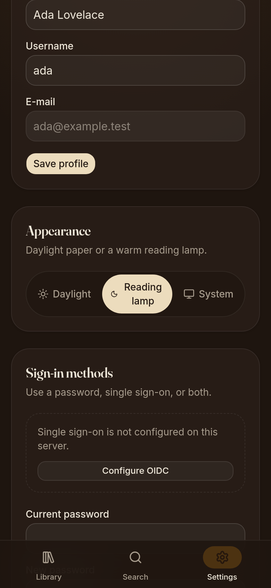

# Retrospine

A personal book tracker with a warm, mobile-first interface. Search Google
Books, keep your shelves (Reading, Want to read, Finished, Set aside), record
milestones on a timeline, and see where a book sits in its series.

<p align="center">
  
  
  
</p>

## Features

- **Shelves** – four reading statuses with animated, cover-first grids and a
  progress bar for books you are reading.
- **Search** – Google Books search by title, author or ISBN with one-tap
  adding to a shelf.
- **Milestones** – a timeline per book: started, progress (page or percent),
  notes, finished, set aside. Milestones move the book between shelves, drive
  the progress bar and support re-reads.
- **Series** – volume number and series name from Google Books, with Open
  Library as a fallback and a manual override. The book page shows the other
  volumes of the same series.
- **Tolino Cloud sync** – connect a tolino account and the books you own,
  where you are in them and what you finished appear on your shelves as
  milestones, automatically in the background.
- **Accounts** – username and password login. The first account created on a
  fresh install becomes the administrator; afterwards registration is closed
  and the admin invites readers from the settings.
- **Single sign-on** – any OpenID Connect provider, configured from the
  settings UI without a restart. Existing local accounts can be connected to
  SSO from their settings and then sign in either way.
- **Themes** – cream "daylight" paper and a warm "reading lamp" dark mode,
  installable as a web app on phones.

## Stack

| Layer      | Choice                                                                   |
| ---------- | ------------------------------------------------------------------------ |
| Framework  | Next.js 16 (App Router, Turbopack, server actions), React 19, TypeScript |
| Styling    | Tailwind CSS v4, shadcn/ui (Radix), Motion, Fraunces + Inter             |
| Auth       | Better Auth (username, admin and generic OAuth plugins)                  |
| Data       | PostgreSQL 17, Drizzle ORM                                               |
| Deployment | Docker multi-stage image, docker compose, GHCR images per release        |

## Run it with Docker

```bash
cp .env.example .env
# set BETTER_AUTH_SECRET (openssl rand -base64 32) and BETTER_AUTH_URL
docker compose up -d --build
```

Open the app (default http://localhost:3000). The first visit shows the setup
page; the account you create there is the administrator. Database migrations
run automatically when the container starts.

Every release is also published as a ready-built image for amd64 and arm64,
`ghcr.io/theblackprism/retrospine` (tags `latest`, `1.2.3`, `1.2`, `1`). The
compose file already names it, so `docker compose pull app && docker compose
up -d` runs the published build instead of compiling on the server.

`BETTER_AUTH_URL` must be the public URL people use in the browser (for
example `https://books.example.com`). It is used for OIDC redirect URIs and
secure cookies. See [docs/deployment.md](docs/deployment.md) for reverse
proxies, backups and upgrades.

## Local development

```bash
pnpm install
docker compose up -d db          # or any Postgres 14+
cp .env.example .env             # DATABASE_URL pointing at localhost
pnpm db:migrate                  # apply migrations
pnpm dev                         # http://localhost:3000
```

| Script             | Purpose                                                 |
| ------------------ | ------------------------------------------------------- |
| `pnpm dev`         | Development server                                      |
| `pnpm build`       | Production build (standalone output)                    |
| `pnpm check`       | Lint, type-check and unit tests                         |
| `pnpm db:generate` | Create a migration after editing `src/lib/db/schema.ts` |
| `pnpm db:migrate`  | Apply migrations                                        |
| `pnpm db:studio`   | Browse the database                                     |

## Environment variables

| Variable               | Required | Description                                                                                       |
| ---------------------- | -------- | ------------------------------------------------------------------------------------------------- |
| `DATABASE_URL`         | yes      | Postgres connection string                                                                        |
| `BETTER_AUTH_SECRET`   | yes      | Signs sessions and encrypts stored OIDC secrets                                                   |
| `BETTER_AUTH_URL`      | yes      | Public base URL of the deployment                                                                 |
| `GOOGLE_BOOKS_API_KEY` | no       | Raises the Google Books quota; works without one at low volume                                    |
| `GOOGLE_BOOKS_COUNTRY` | no       | Country code sent to Google Books (default `US`); avoids 503 answers from unlocatable server IPs   |
| `AUTO_MIGRATE`         | no       | Set to `false` to run `pnpm db:migrate` yourself                                                  |
| `TOLINO_SYNC_INTERVAL` | no       | Minutes between automatic Tolino Cloud syncs (default `60`, `0` disables the scheduler)            |

## Configuring single sign-on

1. In your identity provider create a confidential OIDC client with the
   redirect URI `<BETTER_AUTH_URL>/api/auth/callback/oidc`.
2. As an administrator open **Settings → Single sign-on**, enable it, and
   enter the issuer URL, client id and client secret. Saving verifies the
   provider's discovery document.
3. Readers with an existing local account open **Settings → Sign-in methods
   → Connect** once. From then on the login page offers both the password
   form and the SSO button.
4. Leave **Allow new accounts via SSO** off to keep the instance invite-only;
   turn it on if anyone at your provider may create an account.

Details, including how identities are matched and what the error messages
mean, are in [docs/authentication.md](docs/authentication.md).

## Documentation

| Page | Contents |
| --- | --- |
| [docs/architecture.md](docs/architecture.md) | How the app is put together: request flow, folder map, rendering and caching |
| [docs/data-model.md](docs/data-model.md) | Tables, relations and how to change the schema |
| [docs/authentication.md](docs/authentication.md) | Accounts, roles, sessions, OIDC configuration and linking |
| [docs/books-and-series.md](docs/books-and-series.md) | Search, Google Books client, series resolution, other volumes |
| [docs/milestones.md](docs/milestones.md) | Shelves, milestone types, status transitions, progress and re-reads |
| [docs/tolino-sync.md](docs/tolino-sync.md) | Connecting a tolino account, how books and reading positions are imported |
| [docs/deployment.md](docs/deployment.md) | Docker image, compose, reverse proxy, migrations, backups, upgrades |
| [docs/development.md](docs/development.md) | Setup, scripts, conventions, tests, feature checklist |
| [docs/troubleshooting.md](docs/troubleshooting.md) | Symptoms, causes and fixes |
| [e2e/README.md](e2e/README.md) | Browser smoke test with a mock OpenID Connect provider |

## Project layout

```
src/app/(auth)        login and first-run setup
src/app/(app)         library, search, book detail, settings
src/app/api           auth handler, book search, health check
src/components        UI (shadcn primitives in components/ui)
src/lib/auth          Better Auth configuration (rebuilt when OIDC settings change)
src/lib/books         Google Books and Open Library clients, series resolution
src/lib/db            Drizzle schema, connection, migrations bootstrap
src/lib/library.ts    shelves and milestones
src/lib/tolino        Tolino Cloud client, connection storage, sync engine, scheduler
src/lib/actions       server actions used by the UI
drizzle/              SQL migrations
docs/                 documentation
e2e/                  end-to-end smoke test
```

## License

MIT, see [LICENSE](LICENSE).
