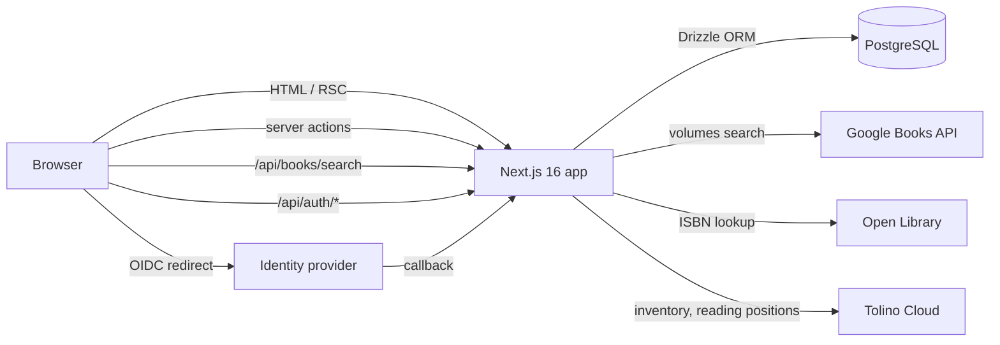

# Architecture

Retrospine is a single Next.js application in front of a PostgreSQL database.
There is no separate API server: pages are React Server Components, mutations
are server actions, and the two JSON endpoints that exist serve the auth
library and the search box.

## Request flow

1. `src/proxy.ts` runs on every page request. It only checks whether a Better
   Auth session cookie exists and redirects to `/login` or `/library`
   accordingly. It never touches the database.
2. The `(app)` layout calls `requireSession()`, which validates the session
   against the database (cached per request with React `cache`). Pages and
   server actions call the same helper, so authorization never relies on the
   proxy alone.
3. Pages read data through the modules in `src/lib` and render on the server.
   Interactive parts (search box, milestone drawer, shelf controls, forms) are
   small client components that call server actions in `src/lib/actions`.
4. Server actions return plain result objects (`ActionResult` or `FormState`
   in `src/lib/actions/state.ts`) instead of throwing, then call
   `revalidatePath` so the next render reflects the change.

## Folder map

| Path | Purpose |
| --- | --- |
| `src/app/(auth)` | Login and first-run setup, outside the app shell |
| `src/app/(app)` | Everything behind login: library, search, book pages, settings |
| `src/app/api/auth/[...all]` | Better Auth handler (sign-in, OIDC callback, sessions) |
| `src/app/api/books/search` | Google Books search proxy that collapses editions into one result per work and marks books already on a shelf |
| `src/app/api/health` | Liveness check used by the Docker `HEALTHCHECK` |
| `src/components/ui` | shadcn/ui primitives (Radix based) |
| `src/components/*` | Application components grouped by feature |
| `src/lib/auth` | Better Auth configuration, lazy instance, session helpers, client |
| `src/lib/books` | Google Books and Open Library clients, series resolution |
| `src/lib/db` | Drizzle schema, connection pool, migration runner |
| `src/lib/library.ts` | Shelves, entries and milestones |
| `src/lib/reading.ts` | Pure helpers deriving progress and reading sessions from milestones |
| `src/lib/settings.ts` | Application settings row and OIDC configuration |
| `src/lib/tolino` | Tolino Cloud client, connection storage, sync engine and scheduler (see [tolino-sync.md](tolino-sync.md)) |
| `src/lib/actions` | Server actions used by client components |
| `src/instrumentation.ts` | Runs pending migrations and starts the Tolino sync scheduler when the server starts |
| `drizzle/` | Generated SQL migrations and their journal |

## Rendering and caching

- Every page that needs a session is rendered on demand (Next lists them as
  `ƒ` dynamic). `getSession()` reads the request headers before anything
  touches the database, which makes `next build` skip prerendering without
  needing a reachable database.
- `/login` and `/setup` call `connection()` for the same reason: they query
  the user count but do not read headers.
- Calls to Google Books and Open Library use Next's fetch cache with
  time-based revalidation (one hour for searches, one day for single volumes,
  seven days for Open Library editions). Only `200` responses are cached, so a
  failed lookup is retried on the next request.
- Cover images are plain `` elements loaded directly from the source
  host. Routing them through the image optimizer would make the server fetch
  every cover and would fail for hosts that are not on the allow list.

## Authentication instance lifecycle

Better Auth is configured in `src/lib/auth/options.ts`. Because the OIDC
provider is stored in the database and editable at runtime, the instance is
created lazily by `getAuth()` in `src/lib/auth/index.ts`: it loads the OIDC
settings, builds a cache key from them and reuses the instance until the key
changes. `invalidateAuth()` is called after the settings form is saved, so a
change takes effect on the next request without a restart. See
[authentication.md](authentication.md) for the flows.

## Theming

`src/app/globals.css` defines the design tokens as CSS variables for the
light ("daylight") theme on `:root` and the dark ("reading lamp") theme on
`.dark`, mapped into Tailwind through `@theme inline`. `next-themes` toggles
the class. Headings use Fraunces, body text uses Inter, both self-hosted via
`@fontsource-variable`. Motion animations respect the user's reduced-motion
preference through `MotionConfig reducedMotion="user"`.
