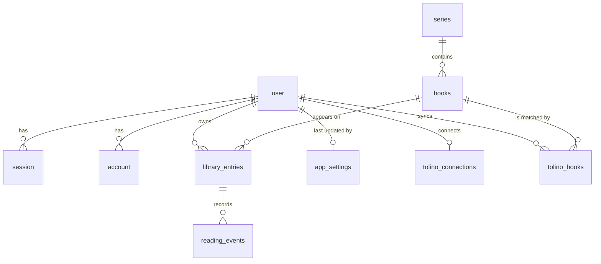

# Data model

The schema lives in `src/lib/db/schema.ts`; migrations are generated from it
with `pnpm db:generate` into `drizzle/` and applied with `pnpm db:migrate` or
automatically at server start.

## Authentication tables

These follow Better Auth's core schema plus the fields added by the
`username` and `admin` plugins and `preferred_language`, which Retrospine
declares as an additional user field in `src/lib/auth/options.ts`. Keep them
in sync when upgrading Better Auth (`npx @better-auth/cli generate` prints
the expected shape).

| Table | Notable columns |
| --- | --- |
| `user` | `name`, `email` (unique), `email_verified`, `image`, `username` (unique, normalized lower-case), `display_username`, `role` (`admin` or `user`), `banned`, `ban_reason`, `ban_expires`, `preferred_language` (ISO 639-1 code preferred for search results; null follows the browser) |
| `session` | `token` (unique), `expires_at`, `ip_address`, `user_agent`, `user_id`, `impersonated_by` |
| `account` | one row per sign-in method: `provider_id` is `credential` for passwords or `oidc` for single sign-on; `account_id` is the user id or the provider subject; OAuth tokens and the password hash live here |
| `verification` | short-lived tokens used by Better Auth flows |

## Application settings

`app_settings` is a single row (`id = 1`, enforced by a check constraint)
created on first access.

| Column | Meaning |
| --- | --- |
| `oidc_enabled` | Whether the SSO button is shown and the provider is registered |
| `oidc_label` | Button label, e.g. "Company login" |
| `oidc_issuer` | Issuer URL; the discovery document is `<issuer>/.well-known/openid-configuration` |
| `oidc_client_id` | OAuth client id |
| `oidc_client_secret` | Client secret, encrypted with AES-256-GCM (see [authentication.md](authentication.md)) |
| `oidc_scopes` | Space separated scopes, always including `openid` |
| `oidc_pkce` | Whether to use PKCE |
| `oidc_allow_signup` | Whether an unknown SSO identity may create a new account |
| `updated_at`, `updated_by` | Audit information |

## Library tables

### `series`

| Column | Meaning |
| --- | --- |
| `name` | Display name, e.g. "Discworld" |
| `normalized_name` | Lower-cased, punctuation-free key used to merge duplicates (unique) |
| `google_series_id` | Google Books series id when known (unique) |
| `primary_author` | Used when searching Google Books for other volumes |

### `books`

One row per edition imported from Google Books, shared by all users.

| Column | Meaning |
| --- | --- |
| `google_id` | Google Books volume id (unique) |
| `isbn13`, `isbn10` | Identifiers used for the Open Library lookup |
| `title`, `subtitle`, `authors[]`, `publisher`, `published_date`, `description`, `page_count`, `categories[]`, `language` | Metadata as reported by Google Books |
| `cover_url`, `thumbnail_url` | Normalized https cover links (larger and small rendition) |
| `series_id`, `series_position` | Resolved series membership; position may be fractional (e.g. 3.5) |
| `series_source` | Where the series came from: `google`, `openlibrary` or `manual` |
| `google_series_id` | Kept even when the series name is still unknown, so books can be linked later |
| `open_library_edition_key`, `open_library_work_key` | Open Library references when the lookup succeeded |

### `library_entries`

The per-user shelf entry. `(user_id, book_id)` is unique.

| Column | Meaning |
| --- | --- |
| `status` | `want_to_read`, `reading`, `finished` or `abandoned` |
| `added_at`, `updated_at` | Shelves are ordered by `updated_at` |

### `reading_events`

The milestone timeline of an entry.

| Column | Meaning |
| --- | --- |
| `type` | `started`, `progress`, `note`, `finished` or `abandoned` |
| `occurred_at` | When it happened (see [milestones.md](milestones.md) for how dates are stamped) |
| `page`, `percent` | Progress markers; either may be null |
| `note` | Free text, up to 2000 characters |
| `source` | `manual` (entered in the UI) or `tolino` (written by the Tolino Cloud sync) |

Deleting a user cascades to their entries and events; deleting a book
cascades to entries; deleting a series only clears `series_id` on its books.

## Tolino Cloud tables

### `tolino_connections`

One row per user (`user_id` is unique). See [tolino-sync.md](tolino-sync.md).

| Column | Meaning |
| --- | --- |
| `reseller_id`, `reseller_name` | The bookshop the tolino account belongs to (e.g. 3 = Thalia.de, 8 = Orell Füssli) |
| `hardware_id` | Device id sent with every request; the web reader's device or one registered by Retrospine |
| `token_url`, `client_id`, `scope` | OAuth details of the shop captured when connecting |
| `access_token`, `access_token_expires_at` | Short-lived token, encrypted like the OIDC secret |
| `refresh_token`, `refresh_token_expires_at` | Rotating refresh token, encrypted |
| `refresh_mode`, `token_refreshed_at` | `server` (the server renews tokens) or `browser` (the reader's browser does, because the bookshop blocks the server); when tokens were last renewed |
| `auto_sync`, `import_unread`, `include_audiobooks` | Sync options |
| `sync_status`, `sync_started_at` | `idle`, `running`, `ok` or `error`; a run older than 20 minutes is considered dead |
| `last_sync_at`, `last_success_at`, `last_error`, `last_summary` | Result of the last run (`last_summary` is JSON with counters) |

### `tolino_books`

A publication of the user's Tolino library together with the reading state
that was last synced. `(user_id, publication_id)` is unique.

| Column | Meaning |
| --- | --- |
| `publication_id` | Tolino id, e.g. `DT0400.9783641243609_A40398678` |
| `book_id`, `match_source` | The matched book and how it was found: `isbn`, `google`, `tolino` (created from Tolino data) or `manual` |
| `ignored` | Excluded from syncing by the user |
| `kind` | `ebook`, `upload` or `audiobook` |
| `title`, `subtitle`, `authors[]`, `isbn13`, `publisher`, `language`, `cover_url`, `purchased_at` | Metadata as reported by the Tolino Cloud |
| `progress`, `progress_at` | Reading position in percent and when it was written, as of the last sync |
| `finished`, `finished_at` | Finished mark as of the last sync |
| `last_seen_at` | Last run in which the publication was present |

Deleting a user cascades to both tables; deleting a book clears `book_id`.

## Changing the schema

1. Edit `src/lib/db/schema.ts`.
2. Run `pnpm db:generate --name <description>` to create a migration in
   `drizzle/`. Review the SQL.
3. Apply it locally with `pnpm db:migrate`. Deployed containers apply it on
   their next start.
