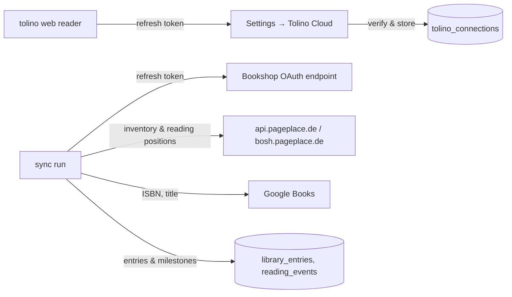

# Tolino Cloud sync

Retrospine can read the library of a tolino account and turn it into shelves
and milestones: books you own appear on your shelves, the position you are at
becomes a progress milestone, and books that tolino considers finished are
marked as finished. The sync is one way (Tolino → Retrospine) and never writes
to the Tolino Cloud.

## How it works

1. **Connecting.** The bookshops (Thalia, Orell Füssli, Osiander, …) protect
   their sign-in pages against scripts, so Retrospine cannot log in with a
   username and password. Instead you sign in to the
   [tolino web reader](https://webreader.mytolino.com/library/) once and copy
   the `refresh_token` from the `token` request in the browser's developer
   tools. Retrospine exchanges it for an access token, looks up the device
   the web reader registered (or registers "Retrospine" as a device), checks
   that it can read your reading positions and stores everything encrypted.
   Refresh tokens rotate: after connecting, the web reader tab will ask you to
   sign in again, which does not affect Retrospine.
2. **Syncing.** A run fetches the inventory (purchases, uploads, optionally
   audiobooks) and the reading state of every publication, matches each
   publication to a book and records what changed since the previous run.
   Runs happen when you press **Sync now**, right after connecting, and
   automatically in the background (see below).
3. **Keeping the connection alive.** The bookshops run Keycloak: access
   tokens last an hour and a refresh token also expires after an hour unless
   it is used, which rotates it. The server refreshes on demand and the
   scheduler refreshes tokens that are about to expire even when no sync is
   due, so a running server keeps the connection alive. If the server was
   down for longer than an hour, the sync fails with "Tolino Cloud sign-in
   failed" and the settings page offers to connect again with a fresh token.

## When the bookshop will not issue tokens to Retrospine

Getting a token from a Thalia group shop (Thalia, Orell Füssli, Osiander)
is guarded twice over, and both guards were confirmed against the live
`www.orellfuessli.ch/auth/oauth2/token` endpoint:

- **Cloudflare blocks the server.** The endpoint answers an HTML "Zugriff
  geblockt" page to any client whose TLS fingerprint is not a real
  browser's, whatever user agent or headers it sends. Node and curl are
  refused; only a real browser gets through.
- **The shop routes by `Origin`.** A browser request carrying
  `Origin: https://webreader.mytolino.com` reaches the real Keycloak token
  endpoint. The same request from any other origin is routed to a decoy that
  echoes the token back in an `invalid_grant` error and never accepts it. A
  page cannot forge `Origin`, so a request from Retrospine's own address
  always hits the decoy.

Between the two, Retrospine can neither exchange a refresh token on the
server (blocked) nor in the reader's browser (wrong origin) for these shops.
What it can do is reuse the tokens the **web reader itself** already
obtained: the web reader ran on `webreader.mytolino.com`, so the access
token in its `token` response is real. The Tolino Cloud hosts
(`api.pageplace.de`, `bosh.pageplace.de`) do not block the server and do not
route by origin, so the server syncs with that access token directly.

- **Paste the whole token response.** The connect form reads the
  `access_token` (plus `refresh_token` and `expires_in`) straight from the
  pasted response and stores them without asking the shop again
  (`extractTokenResponse` in `src/lib/tolino/parse.ts`). The first sync runs
  immediately.
- **A shop that does answer the server or another browser origin** (some
  non-Thalia resellers) still works the old way: paste only the
  `refresh_token` and Retrospine exchanges it on the server, or in the
  reader's browser when the server is blocked
  (`src/lib/tolino/browser.ts`). The connection is then in **server** or
  **browser** mode and `TolinoTokenKeeper` keeps it renewed.
- **Background refresh needs one of those two paths to work.** For the
  Thalia group shops neither does, so the access token simply expires about
  an hour after you paste it; the settings page then shows
  "Tolino Cloud sign-in failed" and the form to connect again. Reconnecting
  takes a few seconds: open the web reader, copy the `token` response, paste.
  Syncs happen while and shortly after you use Retrospine, not unattended
  for days.

The settings page says which mode a connection is in. Once an hour the
scheduler probes the shop again for connections in browser mode and hands
token renewal back to the server as soon as the shop answers it.

Either way the web reader session the token came from must stay alive:
signing out of the web reader revokes it, and the web reader using its own
copy of the refresh token again can invalidate the rotated one Retrospine
holds. The connect form therefore asks the reader to close the web reader
tab without signing out, and to connect again with a fresh token if a later
web reader sign-in breaks the connection. (`tolino-calibre-sync`, a
command-line client that reuses a browser session the same way, gives the
same advice.)

## Matching books

Publications are matched in this order:

1. A book in the database with the same ISBN-13 (purchased books embed the
   ISBN in their publication id, `DT0400.<ISBN>_A…`).
2. Google Books, by `isbn:` first and then by title and author; the volume is
   imported like a search result, including series discovery.
3. A book created from the Tolino metadata alone (title, authors, publisher,
   language, cover). Uploaded files usually end up here.

Free reading samples are skipped. The result is remembered in `tolino_books`,
so a book is matched once. On **Settings → Tolino Cloud** every publication
shows what it was matched to; use the row menu to **link it to a different
book** (a Google Books search) or to **exclude it** from syncing.

If Google Books rate-limits the server during a large first import, the
unmatched books are deferred and matched on the next run instead of being
created from the Tolino data.

## Reading state

The Tolino Cloud stores one bookmark per publication with `progress` (0–1)
and a modification time, and marks finished books with a system tag
(`collection_finished_readings_name`). Retrospine derives:

| Tolino state | Shelf | Milestones |
| --- | --- | --- |
| Never opened | Want to read (if "Add unread books" is on) | – |
| Opened, progress > 0 | Reading | *Started reading* (a second before) and *Progress N %* dated when the bookmark was written |
| Finished tag set, or read past 98 % | Finished | *Finished reading* dated when the tag was set |

On later runs only changes are recorded: a new progress value adds a
*Progress* milestone, a finished mark adds *Finished reading*, and a position
that moved backwards after a book was finished counts as a re-read (a new
*Started reading*). A book you finished or set aside by hand is never moved
backwards, and Tolino data older than your latest milestone is ignored.
Milestones written by the sync carry `source = tolino` and show a small
"tolino" badge on the timeline; you can delete them like any other milestone.

## Options

| Option | Default | Effect |
| --- | --- | --- |
| Sync automatically | on | Include this connection in the scheduled runs |
| Add unread books to "Want to read" | on | Import books you own but have not opened |
| Include audiobooks | off | Also import audiobooks (progress is listening progress) |

## Scheduler

`src/lib/tolino/scheduler.ts` is started from `src/instrumentation.ts` once
per server process. Every five minutes it syncs the connections whose last
run is older than `TOLINO_SYNC_INTERVAL` minutes (default 60) and refreshes
tokens that expire within three hours. Set `TOLINO_SYNC_INTERVAL=0` to turn
automatic syncing off; "Sync now" still works. With several replicas set it
on one of them only.

## Supported bookshops

The list in `src/lib/tolino/resellers.ts` contains the shops that run
accounts in the Tolino Cloud and whose OAuth endpoints answer: Thalia.de,
Thalia.at, Orell Füssli / books.ch, Osiander, bücher.de, Hugendubel, eBook.de,
meineBUCHhandlung, IBS.it and Libraccio. The OAuth endpoints are refreshed
from Tolino's reseller configuration service when a connection is created;
the table is the fallback.

## Endpoints used

There is no public API; the requests mirror the official web reader
(`src/lib/tolino/client.ts`):

| Purpose | Request |
| --- | --- |
| Bookshop OAuth details | `GET bosh.pageplace.de/bosh/rest/v2/resellerconfig` |
| Token refresh | `POST <shop>/auth/oauth2/token` (`grant_type=refresh_token`, body exactly as the web reader sends it); from the browser unless the server is proven not to be blocked |
| Devices | `POST bosh.pageplace.de/bosh/rest/handshake/devices/list`, `POST api.pageplace.de/v1/devices`, fallback `POST bosh.pageplace.de/bosh/rest/v2/registerhw` |
| Inventory | `GET api.pageplace.de/v8/inventory?page=…` (paged), fallback `GET bosh.pageplace.de/bosh/rest/inventory/delta` |
| Reading state | `PATCH api.pageplace.de/v4/reading-metadata?paths=publications,audiobooks` with an empty revision (full state), fallback `PATCH bosh.pageplace.de/bosh/rest/sync-data` |

Every `api.pageplace.de` request falls back to its BOSH counterpart when it
fails for any reason but the device limit; the BOSH requests are the ones
the command-line clients (`tolino-python`, `tolino-calibre-sync`) use. The
request shapes were checked against the web reader 5.15.2 bundle and
against `tolino-calibre-sync`. Only the response parsing is covered by unit
tests (`src/lib/tolino/__tests__/parse.test.ts`); the endpoints themselves
can only be exercised with a real account.
