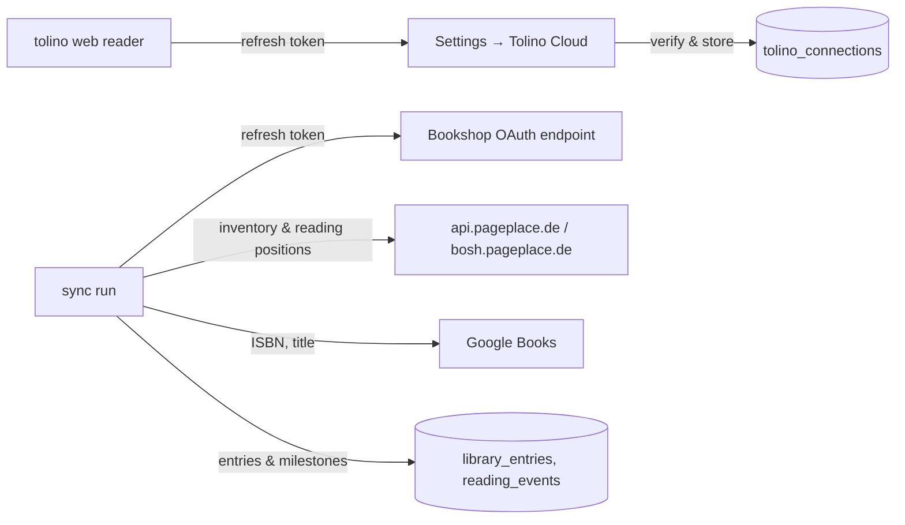

# Tolino Cloud sync

Retrospine can read the library of a tolino account and turn it into shelves
and milestones: books you own appear on your shelves, the position you are at
becomes a progress milestone, and books that tolino considers finished are
marked as finished. The sync is one way (Tolino → Retrospine) and never writes
to the Tolino Cloud.

## How it works

1. **Connecting.** The bookshops (Thalia, Orell Füssli, Osiander, …) protect
   their sign-in pages against scripts, so Retrospine cannot log in with a
   username and password. Instead you sign in to the
   [tolino web reader](https://webreader.mytolino.com/library/) once and copy
   the `refresh_token` from the `token` request in the browser's developer
   tools. Retrospine exchanges it for an access token, looks up the device
   the web reader registered (or registers "Retrospine" as a device), checks
   that it can read your reading positions and stores everything encrypted.
   Refresh tokens rotate: after connecting, the web reader tab will ask you to
   sign in again, which does not affect Retrospine.
2. **Syncing.** A run fetches the inventory (purchases, uploads, optionally
   audiobooks) and the reading state of every publication, matches each
   publication to a book and records what changed since the previous run.
   Runs happen when you press **Sync now**, right after connecting, and
   automatically in the background (see below).
3. **Keeping the connection alive.** The bookshops run Keycloak: access
   tokens last an hour and a refresh token also expires after an hour unless
   it is used, which rotates it. The server refreshes on demand and the
   scheduler refreshes tokens that are about to expire even when no sync is
   due, so a running server keeps the connection alive. If the server was
   down for longer than an hour, the sync fails with "Tolino Cloud sign-in
   failed" and the settings page offers to connect again with a fresh token.

## When the bookshop blocks the server

Token requests go to the bookshop, and its bot protection (Cloudflare in
front of the Thalia group shops) scores the client: requests identifying as
a tolino device are let through from most addresses, but some hosting
ranges are refused with an HTML "Zugriff geblockt" page no matter what.
Retrospine finds out on its own: when connecting, the server sends a
deliberately invalid refresh token to the token endpoint (`invalid_grant`
proves it is reachable, the block page proves it is not), and a block during
a later refresh switches the connection over as well.

For a blocked server the connection runs in **browser mode**
(`tolino_connections.refresh_mode = browser`):

- The connect form exchanges the pasted token in the reader's browser
  (`src/lib/tolino/browser.ts`); the token endpoint allows cross-origin
  requests, and browsers are not blocked. The resulting tokens are handed to
  the server, which still talks to the Tolino Cloud itself.
- While Retrospine is open in a browser tab, `TolinoTokenKeeper` (mounted in
  the app layout) renews the access token 15 minutes before it expires and
  gives the rotated refresh token back to the server. Tabs coordinate
  through the Web Locks API so only one of them refreshes.
- Scheduled syncs run as long as the access token is valid. About an hour
  after the last open tab, the tokens expire; the next visit shows
  "Tolino Cloud sign-in failed" and the form to connect again. In other
  words: syncs happen while and shortly after you use Retrospine, not
  unattended for days.

The settings page says which mode a connection is in. Once an hour the
scheduler probes the shop again for connections in browser mode and hands
token renewal back to the server as soon as the shop answers it.

## Matching books

Publications are matched in this order:

1. A book in the database with the same ISBN-13 (purchased books embed the
   ISBN in their publication id, `DT0400.<ISBN>_A…`).
2. Google Books, by `isbn:` first and then by title and author; the volume is
   imported like a search result, including series discovery.
3. A book created from the Tolino metadata alone (title, authors, publisher,
   language, cover). Uploaded files usually end up here.

Free reading samples are skipped. The result is remembered in `tolino_books`,
so a book is matched once. On **Settings → Tolino Cloud** every publication
shows what it was matched to; use the row menu to **link it to a different
book** (a Google Books search) or to **exclude it** from syncing.

If Google Books rate-limits the server during a large first import, the
unmatched books are deferred and matched on the next run instead of being
created from the Tolino data.

## Reading state

The Tolino Cloud stores one bookmark per publication with `progress` (0–1)
and a modification time, and marks finished books with a system tag
(`collection_finished_readings_name`). Retrospine derives:

| Tolino state | Shelf | Milestones |
| --- | --- | --- |
| Never opened | Want to read (if "Add unread books" is on) | – |
| Opened, progress > 0 | Reading | *Started reading* (a second before) and *Progress N %* dated when the bookmark was written |
| Finished tag set, or read past 98 % | Finished | *Finished reading* dated when the tag was set |

On later runs only changes are recorded: a new progress value adds a
*Progress* milestone, a finished mark adds *Finished reading*, and a position
that moved backwards after a book was finished counts as a re-read (a new
*Started reading*). A book you finished or set aside by hand is never moved
backwards, and Tolino data older than your latest milestone is ignored.
Milestones written by the sync carry `source = tolino` and show a small
"tolino" badge on the timeline; you can delete them like any other milestone.

## Options

| Option | Default | Effect |
| --- | --- | --- |
| Sync automatically | on | Include this connection in the scheduled runs |
| Add unread books to "Want to read" | on | Import books you own but have not opened |
| Include audiobooks | off | Also import audiobooks (progress is listening progress) |

## Scheduler

`src/lib/tolino/scheduler.ts` is started from `src/instrumentation.ts` once
per server process. Every five minutes it syncs the connections whose last
run is older than `TOLINO_SYNC_INTERVAL` minutes (default 60) and refreshes
tokens that expire within three hours. Set `TOLINO_SYNC_INTERVAL=0` to turn
automatic syncing off; "Sync now" still works. With several replicas set it
on one of them only.

## Supported bookshops

The list in `src/lib/tolino/resellers.ts` contains the shops that run
accounts in the Tolino Cloud and whose OAuth endpoints answer: Thalia.de,
Thalia.at, Orell Füssli / books.ch, Osiander, bücher.de, Hugendubel, eBook.de,
meineBUCHhandlung, IBS.it and Libraccio. The OAuth endpoints are refreshed
from Tolino's reseller configuration service when a connection is created;
the table is the fallback.

## Endpoints used

There is no public API; the requests mirror the official web reader
(`src/lib/tolino/client.ts`):

| Purpose | Request |
| --- | --- |
| Bookshop OAuth details | `GET bosh.pageplace.de/bosh/rest/v2/resellerconfig` |
| Token refresh | `POST <shop>/auth/oauth2/token` (`grant_type=refresh_token`), sent with a tolino device user agent because the shops block generic clients; from the browser when the server is blocked |
| Devices | `POST bosh.pageplace.de/bosh/rest/handshake/devices/list`, `POST api.pageplace.de/v1/devices` |
| Inventory | `GET api.pageplace.de/v8/inventory?page=…` (paged), fallback `GET bosh.pageplace.de/bosh/rest/inventory/delta` |
| Reading state | `PATCH api.pageplace.de/v4/reading-metadata?paths=publications,audiobooks` with an empty revision (full state), fallback `PATCH bosh.pageplace.de/bosh/rest/sync-data` |

Only the response parsing is covered by unit tests
(`src/lib/tolino/__tests__/parse.test.ts`); the endpoints themselves can only
be exercised with a real account.
